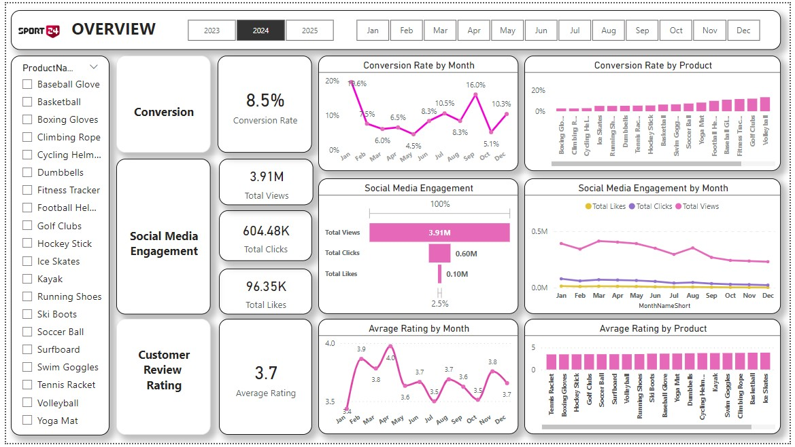

# Marketing-Analytics

Full Dashboard - [See Full Dashboard Here!](https://app.powerbi.com/view?r=eyJrIjoiMjQ1MjEwMWUtYTRkZi00NWYxLTg1OTAtMzk0NjMyOGQ5MzE2IiwidCI6ImRmODY3OWNkLWE4MGUtNDVkOC05OWFjLWM4M2VkN2ZmOTVhMCJ9)

🎯 Project Objective : 
Sports 24, an online retail business, is facing reduced customer engagement and conversion rates despite substantial investments in new marketing campaigns. With high marketing expenses yielding low returns, 
the company seeks to analyze customer feedback and identify areas for improvement in its marketing strategies.

Key Points:
1. Reduced Customer Engagement: The number of customer interactions and engagement with the site and marketing content has declined.
2. Decreased Conversion Rates: Fewer site visitors are converting into paying customers.
3. High Marketing Expenses: Significant investments in marketing campaigns are not yielding expected returns.
4. Need for Customer Feedback Analysis: Understanding customer opinions about products and services is crucial for improving engagement and conversions.

Goals And Required Insights --
1. Increase Conversion Rates:
Goal: Identify factors impacting the conversion rate and provide recommendations to improve it.
Insight: Highlight key stages where visitors drop off and suggest improvements to optimize the conversion funnel.
2. Enhance Customer Engagement:
Goal: Determine which types of content drive the highest engagement. 
Insight: Analyze interaction levels with different types of marketing content to inform better content strategies.
3. Improve Customer Feedback Scores:
Goal: Understand common themes in customer reviews and provide actionable insights.
Insight: Identify recurring positive and negative feedback to guide product and service improvements.

Tools used -
Mysql : 
1. Database creation
2. Table Creation & Dataset Import
3. Data Checkup
4. Data Cleanup

Python :
To carry out customer sentiment analysis by integration with mysql

Power BI :
1. Integrated with mysql
2. Import dataset through sql quries
3. Data modeling
4. Dax for calender table
5. Mesures creation
6. Report building : Overview, Conversion details, Social media details, Cusotmer review details

PowerPoint Presentation :
Create PPT to present insights in a concise way.

Insights :
1. Increase Conversion Rates: 
Target High-Performing Product Categories: Focus marketing on products with high conversion rates, like Kayaks, Ski Boots, and Baseball Gloves. Launch seasonal promotions or 
personalized campaigns during peak months (e.g., January and September) to maximize trends.

2. Enhance Customer Engagement: 
Revitalize Content Strategy: Improve declining views and interaction rates by experimenting with engaging formats like interactive videos or user-generated content. Optimize call-to-action placement in social media and blog posts, especially during low-engagement months (August to December).

4. Improve Customer Feedback Scores: 
Address Mixed and Negative Feedback: Create a feedback loop to analyze mixed and negative reviews for recurring issues. Develop action plans to resolve these concerns, follow up with dissatisfied customers to address their issues, and encourage re-rating to help raise the average rating closer to the 4.0 target.

